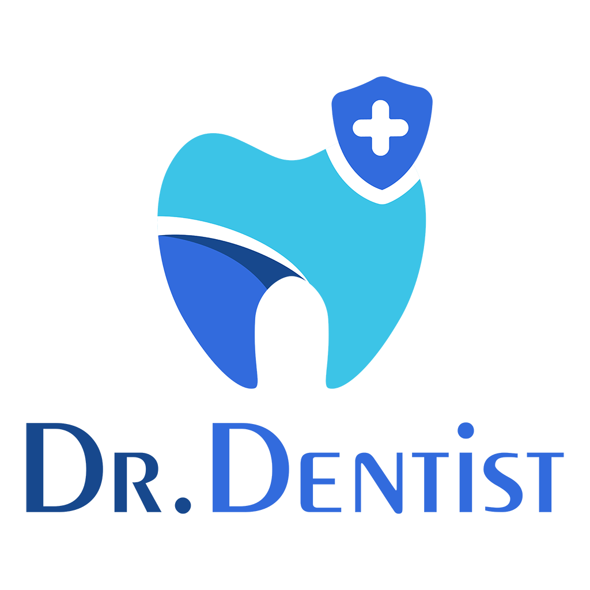

[](https://dotnet.microsoft.com/en-us/download/dotnet/7.0) [](https://dotnet.microsoft.com/en-us/download/dotnet/7.0)

[](https://github.com/phamquangvinhfpt/dr-dentist-api/actions/workflows/dotnet.yml)

<p align="center">
  <a href="#" target="_blank">
    
  </a>
</p>

# DCMS-NET-API

This is a project to build a RESTful API for the DCMS-NET project. The project is built on .NET 7 and PostgreSQL 16.

## Getting started

To make it easy for you to get started with project, here's a list of recommended next steps.

## Before getting started

### Install Environment:

- https://dotnet.microsoft.com/download/dotnet/7.0
- https://visualstudio.microsoft.com/
- https://redis.io/docs/latest/operate/oss_and_stack/install/install-redis/

## Clone repository

``` bash
git clone https://github.com/phamquangvinhfpt/dr-dentist-api.git
cd DR-DENTIST-API
dotnet run --project .\src\Host\Host.csproj --configuration Release
```

## Configuration
Setup database connection strings at hangfire.json and database.json
- database.json
```
{
  "DatabaseSettings": {
    "DBProvider": "postgresql",
    "ConnectionString": "Host=localhost;Port=5432;Database=dcms-db-test;Username=postgres;Password=12345;Include Error Detail=true"
  }
}
```
- hangfire.json
```
{
  ...
    "Storage": {
      "StorageProvider": "postgresql",
      "ConnectionString": "Host=localhost;Port=5432;Database=dcms-db-test;Username=postgres;Password=12345;Include Error Detail=true",
      "Options": {
        "CommandBatchMaxTimeout": "00:05:00",
        "QueuePollInterval": "00:00:01",
        "UseRecommendedIsolationLevel": true,
        "SlidingInvisibilityTimeout": "00:05:00",
        "DisableGlobalLocks": true
      }
    },
  ...
}
```

- signalr.json
```
{
  "SignalRSettings": {
    "UseBackplane": true,
    "Backplane": {
      "Provider": "redis",
      "StringConnection": "localhost:6379"
    }
  }
}
```

- cache.json
```
{
  "CacheSettings": {
    "UseDistributedCache": true,
    "PreferRedis": true,
    "RedisURL": "localhost:6379"
  }
}
```

## Install redis on docker
```bash
docker run -d --name redis-stack -p 6379:6379 -p 8001:8001 redis/redis-stack:latest
```

## Started project
```bash
dotnet run --project .\src\Host\Host.csproj --configuration Release
```

## Application URL
- Local environment: https://localhost:5001/swagger/index.html
- Production environment: https://api.drdentist.me/swagger/index.html

### Account for testing: All same pass 123Pa$$word!

- Admin: admin@root.com
- Staff: staff@root.com
- Doctor: dentist@root.com
- Patient: patient@root.com
- Patient for testing: patient1-4@root.com

```bash
curl -X 'POST' \
  'https://localhost:5001/api/tokens' \
  -H 'accept: application/json' \
  -H 'tenant: root' \
  -H 'Content-Type: application/json' \
  -d '{
  "email": "admin@root.com",
  "password": "123Pa$$word!",
  "captchaToken": "9PA}rTVa^9*1tCyiNTk?ix=.dq)6kW",
  "deviceId": "web"
}'
```